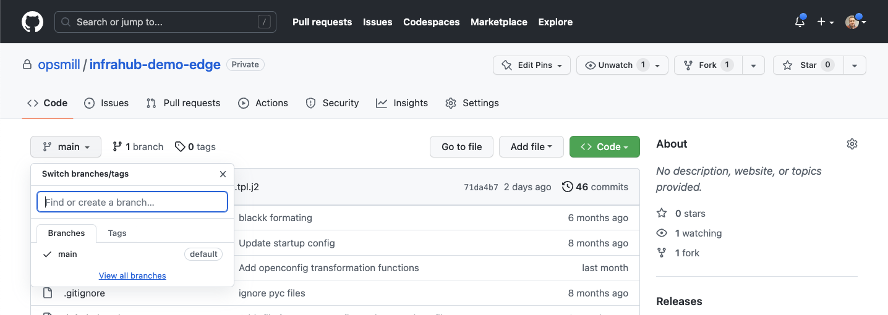

# Build a local Sandbox Environment

The project includes a local sandbox environment that can be used to experiment and/or demo Infrahub.
The main requirements to run the Sandbox environment are :
- Invoke 2.x
- Docker & Docker Compose

## Prepare the Sandbox Environment

```
invoke build
invoke init
```

You can then start all the services with

```
invoke start
```

The GraphQL interface will be available at `http://localhost:8000/graphql`


# Explore Infrahub with a guided demo

To help you get started with Infrahub, a guided demo is included in the project based on a simple 6 nodes network.

```mermaid
flowchart LR
    ord1edge1(ord1-edge1)
    ord1edge2(ord1-edge2)
    jfk1edge1(jfk1-edge1)
    jfk1edge2(jfk1-edge2)
    atl1edge1(atl1-edge1)
    atl1edge2(atl1-edge2)
    subgraph ORD1
        ord1edge1 --- ord1edge2
    end
    subgraph JFK1
        direction RL
        jfk1edge1 --- jfk1edge2
    end
    subgraph ATL1
        direction BT
        atl1edge1 --- atl1edge2
    end
    ord1edge1 --- jfk1edge1
    ord1edge1 --- atl1edge1
    jfk1edge1 --- atl1edge1
    ord1edge2 --- jfk1edge2
    ord1edge2 --- atl1edge2
    jfk1edge2 --- atl1edge2
```

## Pre-requisite

### Generate the data for the demo

The data for the topology described above can be generated with the following command.
```
invoke load-test-data
```

### Fork & Clone the repository for the demo

Create a fork of the repository https://github.com/opsmill/infrahub-demo-edge
The goal is to have a copy of this repo under your name this way your demo won't influence others.

Once you have created a fork in Github, you'll need a Personal Access Token to authorize Infrahub to access this repository.

<details>
  <summary>How to create a Personal Access Token in Github</summary>

  1. Go to settings > Developer Settings > Personal access tokens
  2. Select Fine-grained tokens
  3. Limit the scope of the token in **Repository Access** > **Only Select Repositories**
  4. Grant the token permission to `Read/Write` the **Content** of the repository

  

</details>


> If you already cloned the repo in the past, ensure there only the main branch is present in Github.
If you other branches are present, it's recommanded to delete them for now.

<details>
  <summary>How to Delete a branch in Github</summary>

  1. Select the name of the active branch in the top left corner (usually main)
  2. Select `View All Branches` at the bottom of the popup
  3. Delete all branches but the branch `main`, with the trash icon on the right of the screen

  

</details>


## Explore the data that have been loaded into the database

You should be able to access the GraphQL interface at [http://localhost:8000/graphql](http://localhost:8000/graphql)

Query the name of all devices
```graphql
# Endpoint : http://127.0.0.1:8000/graphql/main
query {
  device {
    name {
      value
    }
  }
}
```

Query all interfaces and IP addresses for `ord1-edge`
```graphql
# Endpoint : http://127.0.0.1:8000/graphql/main
query {
  device(name__value: "ord1-edge1") {
    name {
      value
    }
    interfaces {
      id
      name {
        value
      }
      description {
        value
      }
      role {
        name {
        	value
        }
      }
    }
  }
}
```

## Integrate the Git Repository with the data in the Graph


```graphql
# Endpoint : http://127.0.0.1:8000/graphql/main
mutation {
  repository_create(
    data: {
      name: { value: "infrahub-demo-edge" }
      location: { value: "https://github.com/<YOUR GITHUB USERNAME>/infrahub-demo-edge.git" }
      username: { value: "<YOUR GITHUB USERNAME>" }
      password: { value: "<YOUR PERSONAL ACCESS TOKEN>" }
    }
  ) {
    ok
    object {
      id
    }
  }
}
```

### Validate that all resources included in the Git repository are working properly

- The template **device_startup** should render properly at [http://localhost:8000/rfile/device_startup?device=ord1-edge1](http://localhost:8000/rfile/device_startup?device=ord1-edge1)
- The Python Transform **Openconfig Interface** should render properly at [http://localhost:8000/transform/openconfig/interfaces?device=ord1-edge1](http://localhost:8000/transform/openconfig/interfaces?device=ord1-edge1)

## Create a new Branch and load some data

Create a new branch named `cr1234`
```graphql
# Endpoint : http://127.0.0.1:8000/graphql/main
mutation {
  branch_create(data: { name: "cr1234", is_data_only: false}) {
    ok
    object {
      id
      name
    }
  }
}
```

### Add a new interface and a new IP address in the Graph
Add a new interface `Ethernet9` to the device `ord1-edge1`
```graphql
# Endpoint : http://127.0.0.1:8000/graphql/cr1234
mutation {
  interface_create(
    data: {
      name: { value: "Ethernet9" }
      enabled: { value: true }
      description: { value: "new interface in branch" }
      device: { id: "ord1-edge1" }
      status: { id: "active" }
      speed: { value: 10000 }
      role: { id: "spare" }
    }
  ) {
    ok
    object {
      id
      name {
        value
      }
      description {
        value
      }
    }
  }
}
```
> Copy the ID of the newly created interface, we'll need it for the next query

Add a new IP address connected to the new interface

```graphql
# Endpoint : http://127.0.0.1:8000/graphql/cr1234
mutation {
  ipaddress_create(
    data: {
      interface: { id: "<INTERFACE Ethernet9 UUID>" },
      address: { value: "192.168.0.2/24" }
    }
  ) {
    ok
    object {
      id
      address {
        value
      }
    }
  }
}
```

### Generate configuration and transform within the branch

Render a jinja template or a transform on any branch by specifying the name of the branch in the URL `branch=<BRANCH_NAME>`.

- [Render the configuration for `ord1-edge1` on the branch `cr1234`](http://localhost:8000/rfile/device_startup?device=ord1-edge1&branch=cr1234)
- [Generate the Openconfig interface data for `ord1-edge1` on the branch `cr1234`](http://localhost:8000/transform/openconfig/interfaces?device=ord1-edge1&branch=cr1234)


## Modify a file in the Git Repository within the branch as well

From the Github interface, edit the file 